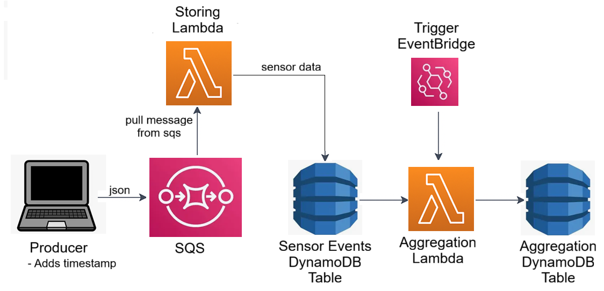

# Sensor Data Pipeline (AWS + Terraform)

Event-driven pipeline that ingests CSV-derived “sensor” records, streams them through SQS, stores raw events in DynamoDB, and periodically computes County-level aggregates.

## ⚙️ Architecture

- Producer: Streams data from the CSV dataset into the pipeline (10 rows/sec).
- SQS: Buffers events from the producer.
- Lambda (storing): Consumes messages from SQS and stores them in DynamoDB (raw events table).
- Lambda (aggregation): Aggregates events by County over a sliding 5-minute window and writes results to an aggregation table.
- DynamoDB:
  - Raw table → all sensor events
  - Aggregation table → per-County counts + total
  - Architecture diagram (docs/diagram.png):




## 📂 Repository Structure
```bash
├── src/                 # Application code
│   ├── producer.py      # Streams data into pipeline
│   ├── aggregator.py    # CLI to invoke aggregation Lambda
│   └── lambda_*.py      # Lambda functions (storing + aggregation)
├── infra/               # Terraform IaC
│   ├── provider.tf      
│   ├── lambda.tf        # Serverless
│   ├── sqs.tf           # SQS Buffer
│   ├── storage.tf       # DynamoDB tables
│   ├── variables.tf
│   └── terraform.tfvars
├── tests/               # Unit + E2E tests
│   ├── e2e/test_pipeline_e2e.py
│   ├── test_aggregation.py
│   ├── test_producer.py
│   └── test_storing.py
├── aggregator.sh        # Run aggregator at specified interval
├── build.sh             # Build Lambda packages and create python virtual env (boto3)
├── deploy.sh            # Deploy infrastructure with Terraform
├── stream.sh            # Start producer (stream indefinitely)
├── unit_test.sh         # Run unit tests
└── README.md
```

## 🚀 Prerequisites
- **Terraform** >= 1.3.0
- **AWS cli** configured with valid credentials
- **Python** >= 3.12

### Verify AWS CLI setup:
- Option 1: run the following command
``` bash
aws configure list
```
You should see your access_key, secret_key, and region set.

- Option 2: You should have the following variables in your environment 
``` bash
AWS_ACCESS_KEY_ID
AWS_SECRET_ACCESS_KEY
AWS_DEFAULT_REGION
```

- Option 3: To deploy to a different region that the one you have configured in AWS cli, uncomment and modify the followwing line in [`infra/terraform.tfvars`](infra/terraform.tfvars)
```
//aws_region = "ap-northeast-1"
```

## ⚡Quick Start

```bash
./deploy.sh
./e2e_test.sh
```
- **[deploy.sh](deploy.sh)** - Builds the latest Lambda packages, runs unit tests, and then deploys the infrastructure with Terraform.
- **[e2e_test.sh](e2e_test.sh)** - Streams sample records, triggers the aggregation Lambda, and verifies that DynamoDB aggregates match locally computed results.


## Usage
### Stream
By default, `stream.sh` streams **one event every 100 ms**:
```bash
# stream one event every 100 ms
./stream.sh
```
You can override the rate by passing an argument. For example, to stream 50 events per second:
```bash
# stream one event every 250 ms
./stream.sh 250
```

### Agreggator
The pipeline supports two ways of running the aggregation Lambda:
1. Automatic trigger in AWS
    - The aggregation Lambda is scheduled via EventBridge to run automatically at every 1 minute.
    - This continuously updates the aggregates in DynamoDB without manual intervention.

2. Local invocation
    - You can also invoke the aggregation Lambda, and inspect the results values stored in the DynamoDB aggregation table by using the `aggregator.sh` script.
    - By default, `aggregator.sh` invokes the lambda aggragation every 10 s or you can override the loop interval by passing an argument.
```bash
# Invoke every 10 seg
./aggregator.sh

# Invoke every 5 seg
./aggregator.sh 5

```
### Testing
```bash
./unit_test.sh  # Unit tests: 
./e2e_test.sh   #End-to-end (after deploy): 
```

### Build
The `build.sh` script performs:
- Install the python dependencies needed for the python files in a virtual environment in `.venv` directory
- Check the python sintax
- Run the `unit_test.sh` script
- Package the lamba funcions in zip files in the `build` directory
- Downloads `Recommended_Fishing_Rivers_And_Streams.csv` if is not present

```bash
./build.sh  # Unit tests: 
```

### Redeploy / Update Flow
1. Modify code.
2. Run `./deploy.sh`, it will build, run unit test, and deploy.
3. Run `./e2e_test`, test that all the pipeline is working as expected


## Data Model

Data table [`aws_dynamodb_table.sensor_events`](infra/storage.tf):

**You can see the data stored in your AWS console, in the DynamoDB table data-pipeline-challenge-asotelo-sensor-events**
- All the original data
- pk: constant logical partition
- ts: ISO8601 timestamp (range/sort key)
- expires_at: TTL ~6 minutes for easy visualization of new results during development and testing

Aggregates table [`aws_dynamodb_table.County_aggregates`](infra/storage.tf):

**You can see the County aggregates in your AWS console, in the DynamoDB table data-pipeline-challenge-asotelo-County_aggregates**
- updated: ISO8601 timestamp of aggregation batch
- Per-County computed aggregate (implementation inside Lambda code).


6. Query DynamoDB (example):
   aws dynamodb scan --table-name $(terraform -chdir=infra output -raw sensor_table_name) --max-items 5


## Configuration
Terraform tunables in [`infra/variables.tf`](infra/variables.tf):
- SQS batch size: `sqs_lambda_batch_size`
- Queue retention / visibility: `sensor_queue_retention_seconds`, `sensor_queue_visibility_timeout`
- Lambda runtime: `lambda_runtime`
- Schedule toggle: `enable_aggregation_schedule`
- Schedule expression: `aggregation_schedule_expression`


## Lambda Packaging

Handled by [build.sh](build.sh):
- Zips: [build/lambda_storing.zip](build/lambda_storing.zip), [build/lambda_aggregation.zip](build/lambda_aggregation.zip)
- Referenced in Terraform via `storing_lambda_zip`, `aggregation_lambda_zip` in [`infra/variables.tf`](infra/variables.tf).


## Teardown
```bash
cd infra
terraform destroy
```


## Operational Notes
- Short TTL keeps raw table lean for sliding window aggregation.
- SQS batch size kept small (`1` default) to simplify ordering & error isolation.
- IAM least-privilege policies: see inline DynamoDB + SQS policies in [`infra/lambda.tf`](infra/lambda.tf).
- Error visibility via CloudWatch Logs (basic execution role attachment).


## Troubleshooting
- No aggregates appearing → ensure schedule enabled (`enable_aggregation_schedule=true`) or invoke manually.
- Stale code after deploy → confirm build zip timestamps and Terraform re-applied.
- If there are problems due to the environment, you can try running inside an image built from `.devcontainer/Dockerfile`. I used this container for developing purposes, but a formal conteinerization process was outside of the scope of this challenge.


## 📑 Notes
- AWS credentials are not included in this repo.
- Reviewers should deploy with their own AWS account.